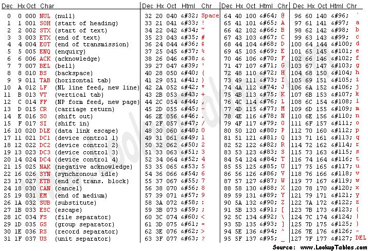

## <a id="LO9.1">9.1 - The FastQ file format</a>

Results of sanger sequencing are usually fasta files (obtained from processing chromatograms). Most high-throughput sequencing machines output [fastq files](https://en.wikipedia.org/wiki/FASTQ_format), the “de facto” current standard in HTS. Like fasta, fastq files are simply text files, but where each block of information (a sequenced DNA fragment, or read) in this format is encoded as 4 lines:

	@read_identifier
	read_sequence
	+ separator line
	base_qualities
	
For example, here you have 8 lines of a fastq file, corresponding to 2 sequences:

	@HWI-M01876:76:000000000-AF16W:1:1101:10853:1000 1:N:0:CGTGACAGAT
	NTGTACTTCATCCGAAACTCGTGCTCATCTCTGCTCAGATCGGAAGAGCACACGTCTGAACTCCAGTCACCGTGAT
	+
	#8ABCFGGGFCEDCFGGGGGGGFFCGEFGGGGGGFGGGGGGGGDEFGGGGGGGGGGGGGGGGGFFFEGGGGGGGGF
	@HWI-M01876:76:000000000-AF16W:1:1101:16471:1000 1:N:0:CGTGAACTTG
	NTTCCAGATATTCGATGCATGTGCCGCTCCTGTCGGAGATCGGAAGAGCACACGTCTGAACTCCAGTCACCGTGAT
	+
	#8BCCGGGGGGGGGGGGGGGGGGGGGGGGGGGGGGGGGGGGGGGEGGGGFGGGGGGGGGGGGGGGGGGGGGGGGGG

Each base has a quality character associated with it, representing how confidently the machine identified (called) the base. The probability of error per base is given as a [Phred score](https://en.wikipedia.org/wiki/Phred_quality_score), calculated from an integer value (Q) derived from the quality character associated to the base. The probability of error is given by the Phred score using P(Q)=10^(-Q/10). Useful reference values of Q include:
* Q=10 - 90% accuracy (0.1 error)
* Q=20 - 99% accuracy (0.01 error)
* Q=30 - 99.9% accuracy (0.001 error)
* Q=40 - 99.99% accuracy (0.0001 error)

Although there's theoretically no limit, Q usually goes up to around 40 in recent illumina machines.

To obtain this Q value from the character associated to the quality of the base, we have to know that each character (such as '#') has an [ASCII](https://en.wikipedia.org/wiki/ASCII) decimal value associated (for example, '#' has a value of 35). The Q value of a character is the decimal value corresponding to the entry of that character in the ASCII table, subtracted by 33. For example Q('#') = 35 – 33.

**NOTE**: To understand why we need to subtract 33, we have to look into the ASCII table below. We can see that the first visible character ('!') has decimal value 33. This allows visual inspection of qualities.



Looking at the first read of our fastq example, we can see it starts with 'N' (unknown), with an associated quality character '#'. To know how confident the machine was in reading that base, we calculate:
- Q = 35 (ASCII decimal value of '#') - 33 (ASCII decimal value of '!') = 2
- p(2) = 10^(-2/10) = 63% (probability of error)

Given this probability of error, it is not surprising that the machine could not confidently say which base was in that position and therefore placed an 'N' in that position. It is fairly common that in the first bases the machine is still calibrating, and sometimes there is less confidence in the called base.
<br/>
<br/>

**TASK**: Calculate the probability of error of the bases of the following read in the fastq format:

	@SRR022885.1 BI:080102_SL-XAR_0001_FC201E9AAXX:6:1:752:593/1
	CGTACCAATTATTCAACGTCGCCAGTTGCTTCATGT
	+
	IIIIIIIIII>IIIIIII@IIII.I+I>35I0I&+/

**NOTE**: Phred+33 (Sanger fastq) is the current standard format. Nonetheless, with older illumina data (before 2009) preferred to start at the character '@' (ASCII: 64) instead of '!'. This Phred+64 format is the old illumina fastq. Some tools (like FastQC) can infer the format, while in others you need to specify.

**QUESTION**: What is the probability of error of the first base of the read?
<details><summary>Click Here to see the answer</summary><p>
The base quality character is 'I', which corresponds to the decimal 73 in the ASCII table. Q = 73-33 = 40. P(40) = 10^(-40/10) = 10^-4 = 0.01% error.
</p></details>
<br/>

**QUESTION**: What is the probability of error of the last base of the read?
<details><summary>Click Here to see the answer</summary><p>
The base quality character is '/', which corresponds to the decimal 47 in the ASCII table. Q = 47-33 = 14. P(14) = 10^(-14/10) = 10^-1.4 ~= 4% error.
</p></details>
<br/>

**QUESTION**: If all bases of a ficticious machine had a Q=20 (1% probability of error), what would be the probability that one 100bp read from that machine would be completely correct?
<details><summary>Click Here to see the answer</summary><p>
P(correct)=(0.99)^100 ~= 36.6%!
<br/>

This serves to exemplify that most reads in current sequencing machines are likely to have at least one base incorrect.
</p></details>
<br/>

Many sequencing machines can read both ends of a fragment. In this case, the machine will generate two **paired** fastq files, one with the forward reads and another with the reverse reads. You can find an example of this is the example fastq files paired_end_example_1 (containing the forward reads) and paired_end_example_2 (containing the reverse reads). These fastq are paired because the reads for the same fragment are in the same order in the two files. For example, the first read in the forward fastq correponds to the forward reading of the same fragment as the first read in the reverse fastq.


**QUESTION**: Inside the folder fastq_examples you can see several compressed fastq files. Uncompress the fastq files paired_end_example_1.fastq.gz and paired_end_example_2.fastq.gz that are in the folder fastq_examples (either by clicking on the files, or using gunzip on the command line). Open the uncompressed fastq files using any text editor (eg. kate). Can you see a relationship betweem the reads in both files?
<details><summary>Click Here to see the answer</summary><p>
The read identifiers are the same, in the same order (though the sequences are not). This is because they are readings of the same fragment, one (_1) in the forward and another (_2) in the reverse direction. Often the indication of forward and reverse is in the identifier itself.
</p></details>
<br/>
<br/>

**NOTE**: Assess how well you achieved the learning outcome. For this, see how well you responded to the different questions during the activities and also make the following questions to yourself.

* How well do you understand the content of a fastQ file?

* Can you manually calculate the probability of error associated to any given base in a fastq file?

* Did you understand the difference between single-end and paired-end reads?
<br/>
<br/>
<br/>

## <a id="LO9.2">9.2 - Quality Check of FastQ data</a>

High Throughput Sequencing machines read thousands or millions of sequences in parallel. As you can imagine, this usually generates large fastq files, with millions of lines. Manually inspecting the quality of each read is out of the question. Specialized software has been developed to provide quality measures for fastq files generated by HTS machines. [FastQC](http://www.bioinformatics.babraham.ac.uk/projects/fastqc/) is a popular program to generate quality reports on fastq data. In fact, this is usually the first thing you should do once you receive a new dataset. FastQC reports provide a series of plots that allow the user to assess the overall quality of their raw data and detect potential biases and problems. 

Some plots indicate distribution of base qualities along the length of reads. At least for illumina data, on average the quality of each base tends to decrease along the length of the read.


<p style="clear: both;"></p>

Other plots indicate biases in nucleotidic content of reads, either globally (such as %GC plots), or positionally. Global bias in nucleotidic content can be useful to search for signs of contaminants. On the other hand, positional bias are useful to detect presence of artefactual sequences in your reads such as adaptors. Another insight you may obtain from this information are potential biases in the preparation of your library. For example, random hexamer priming is actually not truly random and preferentially selects certain sequences. The currently popular transposase-based enzymatic protocol, although reasonably random, is also not completely random, and you can see this through positional bias, particularly in the beginning of reads. The presence of adaptors is a relatively common event, and therefore specific plots exist to detect the presence of the most commonly used adaptors. Finally, the presence of repetitive sequences can also suggest contaminants, PCR artifacts, or other types of bias.


**NOTE**: Given the size of fastq files (usually in the order of Gb), they are most frequently compressed as fastq.gz files. In fact, most tools (such as FastQC) work directly with fastq.gz to reduce space.
<br/>
<br/>

**TASK**: Open a terminal. type ```fastqc``` and press enter. The graphical interface of FastQC should appear. Open the file MiSeq_76bp.fastq.gz inside of the folder fastq_examples. Look at the different plots you obtained. Next, open the file MiSeq_250bp.fastq.gz.

**QUESTION**: What information is in a FastQC report?
<details><summary>Click Here to see the answer</summary>

A FastQC report includes, among other things:  

  * Basic statistics of the fastq file, including the number of reads and sequence length
  
  * Per base sequence quality, displaying the boxplot distribution of the Phred Quality (Q) per base for all reads.
  
  * Per sequence quality scores displaying the histogram of the mean quality (Q value) of the bases of each read, for all reads
  
  * Per base sequence content, displaying the frequency of each nucleotide at each position of the read
  
  * Per sequence GC content displaying the histogram of the GC frequency of each read, for all reads
  
  * Sequence length distribution displaying the histogram of read lengths
  
  * Sequence duplication levels displaying the histograms of the number of times reads appear with exactly the same sequence
  
  * Overrepresented sequences (not necessarily complete reads) that appear more frequently than randomly expected
  
  * Adapter content indicating the frequency of sequences of know sequencing adaptors along the length of the reads
  
</details>
<br/>

**QUESTION**: What are the main differences between the reports of both fastq files?
<details><summary>Click Here to see the answer</summary>
The MiSeq_250bp fastq file contains 10000 reads of 250bp, while the MiSeq_76bp contains 1000 reads of 76bp. The MiSeq_250bp reads have a lower per base sequence quality at their end, while the reads of the MiSeq_76bp keep a good quality throughout. The MiSeq_76bp reads contain a very noticeable nucleotide positional bias particularly after position 36. MiSeq_250bp also contain a bit of nucleotide positional bias, but less and only for the first 10bp. The MiSeq_250bp reads display an apparently bimodal GC distribution, while the MiSeq_76bp reads seem closer to a single normal distribution. Finally, MiSeq_76bp contain a clear presence of a known Illumina adaptor after position 36 (probably the reason for the nucleotide positional bias we saw before), while MiSeq_250bp contain a much smaller frequency of another Illumina adaptor towards the ends of the reads.
</details>
<br/>
<br/>

**TASK**: Insider the folder fastq_examples, you can see fastq files from different sequencing technologies or applications. In a terminal window, go to the folder fastq_examples. Type ```fastqc *.fastq.gz``` and press enter. Inside the folder, you should now see a series of HTML files with FastQC reports of each of the fastq files. You can open them with the web browser by clicking on them with the mouse, or by running ```firefox *.html```.

**QUESTION**: Can you see differences between the different sequencing technologies?
<details><summary>Click Here to see the answer</summary>
Illumina machines generate shorter reads, all with the same length. Pacbio and nanopore generate (much) longer reads, with diverse read lengths, and of a poorer quality. Illumina generates many more reads, making both technologies complementary to each other (this will become clearer when we look at specific applications). Finally, you can also notice that, independently of the technology, the quality of base quality tends to decrease along the length of the read.
</details>
<br/>

**QUESTION**: What is the major difference between the two paired fastq files of the paired_example?
<details><summary>Click Here to see the answer</summary>
The reverse read has poorer quality bases. This is usually the case, at least for illumina. This is because the reverse reads are generated after the forward reads.
</details>
<br/>
<br/>

**NOTE**: Assess how well you achieve the learning outcome. For this, see how well you responded to the different questions during the activities and also make the following questions to yourself.

* Could you run FastQC on a fastq file?

* Can you broadly list types of information that a FastQC report contains?

* Can you interpret information in a FastQC report to detect potential issues with data in a fastq file?
<br/>
<br/>

## <a id="LO9.3">9.3 - Filtering and Trimming</a>

As you may have noticed before, reads tend to lose quality towards their end, where there is a higher probability of erroneous bases being called. To avoid problems in subsequent analysis, you should remove bases with higher probability of error, usually by trimming poor quality bases from the end.
<br/>
<br/>

**TASK**: Manually remove the bases with Q<30 from the 3' end of the read you analysed before.

	@SRR022885.1 BI:080102_SL-XAR_0001_FC201E9AAXX:6:1:752:593/1
	CGTACCAATTATTCAACGTCGCCAGTTGCTTCATGT
	+
	IIIIIIIIII>IIIIIII@IIII.I+I>35I0I&+/

**QUESTION**: How is the read after this trimming operation?
<details><summary>Click Here to see the answer</summary>

	@SRR022885.1 BI:080102_SL-XAR_0001_FC201E9AAXX:6:1:752:593/1
	CGTACCAATTATTCAACGTCGCCAGTTGCTTCA
	+
	IIIIIIIIII>IIIIIII@IIII.I+I>35I0I

</details>
<br/>

**QUESTION**: Did you remove all lower quality bases from the read? What other strategies you can imagine to filter your reads?
<details><summary>Click Here to see the answer</summary>

* No. There are still low-quality bases in the read (NOTE: this does not mean the base is wrong, just that it is more likely to be wrong). 
	
* Instead of looking only at the last base, one can look at the mean quality of the k (eg. k=4) last bases to decide if a base should be removed or not. Another alternative that is often used is to find the longest continuous stretch of bases with a quality above a certain value.
	
</details>
<br/>

**QUESTION**: Can you remove bases in the middle of reads? Why?
<details><summary>Click Here to see the answer</summary>
	
**NO!** Because you would be making artificial deletions in the sequence.

</details>
<br/>
<br/>

Like you have FastQC to automatically produce plots from fastq files, you also have software to filter low-quality bases from fastq files. [Seqtk](https://github.com/lh3/seqtk) is a very simple tool that you can use to perform this filtering. 
<br/>
<br/>

**TASK**: In a terminal, go to folder fastq_examples. Type ```seqtk trimfq -q 0.01 MiSeq_250bp.fastq.gz > MiSeq_250bp.trimmed.fastq```. 

**QUESTION**: What is this command doing? Use fastQC to check the new fastq file that is created by this command. 
<details><summary>Click Here to see the answer</summary>
	Seqtk removes bad quality bases from the ends of reads. In this case, it removes bases with a probability of error greater than 1% (0.01), corresponding to Q<20.
</details>
<br/>
<br/>
	
Most software for the analysis of HTS data is freely available to users. Nonetheless, they often require the use of the command line in a Unix-like environment (seqtk is one such case). User-friendly desktop software such as [CLC](https://www.qiagenbioinformatics.com/products/clc-genomics-workbench/) or [Ugene](http://ugene.net/) is available, but given the quick pace of development in this area, they are constantly outdated. Moreover, even with better algorithms, HTS analysis must often be run in external servers due to the heavy computational requirements. One popular tool is [Galaxy](https://galaxyproject.org/), which allows even non-expert users to execute many different HTS analysis programs through a simple web interface.
<br/>
<br/>

**TASK**: Let's use Galaxy to run some bioinformatic tools. Open the web browser (eg. Firefox). Type [localhost:8080](localhost:8080) in the URL tab (where you put the web addresses). This means that you are accessing a galaxy instance that is running on your local machine. You should see the Galaxy interface on your web browser. Click on the upload icon on the top left of the interface. Upload into Galaxy the files MiSeq_76bp.fastq.gz and MiSeq_250bp.fastq.gz. You should now seem them on your history in the right panel. You can visualize their content by pressing the view data icon (the eye icon). After you have your data, you're ready to run some tools on your data. The tools are listed on the left panel. Search for fastqc on the tool search bar on the left panel. By clicking on the tool you should have in the middle the interface to run fastQC. To run fastc you just need to select the fastq file and press "Execute". Run fastqc on the fastq files you uploaded and see the result. Still in galaxy again, search for and run "seqtk trimfq" on the file MiSeq_250bp.fastq with the same parameters as you used in the command line. 

As we saw before, sequencing machines (namely, the illumina ones) require that you add specific sequences (adaptors) to your DNA so that it can be sequenced. For many different reasons, such sequences may end up in your read, and you need to remove these artifacts from your sequences.
<br/>

**QUESTION**: How can adaptors appear in your sequences? Take the sample MiSeq_76bp.fastq.gz as an example. 
<details><summary>Click Here to see the answer</summary>
	When the fragment being read is smaller than the number of bases the sequencing machine reads, then it will start reading the bases of the adaptor that is attached to all fragments so they can be read by the machines. In the case of MiSeq_76bp, the fragments were all 36bp, and since 76bp were being read, the remaining bases belong to the illumina adaptor that was used.
</details>
<br/>
<br/>

There are many programs to remove adaptors from your sequences, such as [cutadapt](https://cutadapt.readthedocs.org/en/stable/). To use them you need to know the adaptors that were used in your library preparation (eg. Illumina TruSeq). For this, you need to ask the sequencing center that generated your data.
<br/>
<br/>

**TASK**: In Galaxy, use cutadapt to remove adaptors from MiSeq_76bp.fastq.gz. In this sample, we know that we used the illumina adaptor GTGACTGGAGTTCAGACGTGTGCTCTTCCGATCT, so try to remove this from the 3' end of reads and see the impact of the procedure using FastQC. For this, you need to insert a new adapter in 3', and in the source, select "Enter a custom sequence" (you don't need to add a name, just paste the sequence).

**QUESTION**: What happened? To answer, look at the report from cutadapt, and use FastQC on the fastq that is output by cutadapt. 
<details><summary>Click Here to see the answer</summary>
	Almost no read was affected. This is because what you get is a readthrough, so what is actually in the read is the reverse complement of the adaptor. Now, try the same procedure but with AGATCGGAAGAGCACACGTCTGAACTCCAGTCAC (reverse complement of the previous). This time, most reads should have had the adaptor removed.
</details>
<br/>

[Trimmomatic](http://www.usadellab.org/cms/?page=trimmomatic) is a tool that performs both trimming of low-quality reads, as well as adaptor removal. Moreover, it already contains a library of commonly used adaptors, so you don't need to know their sequence. Similar to FastQC, it is a java program, so you can use it in any operating system (such as Windows and Mac), although unlike FastQC it needs to be run only using the command line.
<br/>

**QUESTION**: Find and select the Trimmomatic tool in Galaxy. What different operations can you perform with Trimmomatic that use the base quality information? 
<details><summary>Click Here to see the answer</summary>
You can perform the following operations with Trimmomatic (either isolated or in combination):

	* ILLUMINACLIP: Cut adapter and other illumina-specific sequences from the read
	
	* SLIDINGWINDOW: Perform a sliding window trimming, cutting once the average quality within the window falls below a threshold
        
	* MINLEN: Drop the read if it is below a specified length

	* LEADING: Cut bases off the start of a read, if below a threshold quality

	* TRAILING: Cut bases off the end of a read, if below a threshold quality

	* CROP: Cut the read to a specified length

	* HEADCROP: Cut the specified number of bases from the start of the read

	* AVGQUAL: Drop the read if the average quality is below a specified value

	* MAXINFO: Trim reads adaptively, balancing read length and error rate to maximise the value of each read
	
</details>
<br/>
<br/>

**TASK**: Let's use Trimmomatic in Galaxy to remove low-quality bases from MiSeq_250bp.fastq.gz, as well as the remainings of illumina Nextera adaptors that are still left in some of the reads. Now Trimmomatic should find it. Let's perform the default operation "SLIDINGWINDOW" of size 4 and average quality 20, and then also the operation "MINLEN" using 36 as the minimum length. Let's also remove the adaptors. For this, select 'Yes' on 'Perform initial ILLUMINACLIP step'. Then select "Nextera (paired-end)" and leave the rest of the parameters as they were. Finally, click on Execute.

**QUESTION**: What happened? To answer, use FastQC on the fastq output by Trimmomatic. 
<details><summary>Click Here to see the answer</summary>
	The base quality distribution improved. Moreover, the few Nextera primers at the end of the reads also disappeared. Nonetheless, read length is now a range, and we have fewer and shorter reads than before.
</details>
<br/>
<br/>

**TASK**: Let's use Trimmomatic in Galaxy with a paired-end dataset. Upload the files paired_end_example_1.fastq.gz and paired_end_example_2.fastq.gz. In Trimmomatic, select 'Paired-end (two separate input file)'. Perform the same operations as before.

**QUESTION**: Now, you get 4 files as output from Trimmomatic. Can you explain what these are? 
<details><summary>Click Here to see the answer</summary>
You get the following paired files: Trimmomatic on paired_end_example_1.fastq (R1 paired) and Trimmomatic on paired_end_example_2.fastq (R2 paired). These contain the paired reads that "survived" the quality operation from both the forward and the reverse and could, therefore, be kept as pairs. Then, you have the cases where just one of the pairs was removed because of low quality. In this case, it cannot be kept as a pair, but in a separate "isolated" file, both for the forward (Trimmomatic on paired_end_example_1.fastq (R1 unpaired)) and the reverse (Trimmomatic on paired_end_example_2.fastq (R2 unpaired)).
</details>
<br/>

**QUESTION**: From the "isolated" reads resulting from Trimmomatic, which one has more reads? Why is that?
<details><summary>Click Here to see the answer</summary>
The forward file (Trimmomatic on paired_end_example_1.fastq (R1 unpaired)) has more reads, because the reverse reads have usually less quality, and therefore are more likely to be removed in the filtering process.
</details>
<br/>
<br/>
<br/>

**NOTE**: Turn on the green light when you're finished. Assess how well you achieve the learning outcome. For this, see how well you responded to the different questions during the activities and also make the following questions to yourself.

* Could you manually remove low-quality bases from the end of a read in the fastq format? 

* Did you broadly understand the challenges of removing bad quality bases from reads? 

* Could you use seqtk to remove low-quality bases from the end of reads in a fastq file? 

* Did you broadly understand the challenges of removing adaptors from reads? 

* Could you use cutadapt to remove adaptors from reads in a fastq file? 

* Could you use trimmomatic to remove bad quality bases and remove adaptors from reads in a fastq file? 

* Did you understand the issue of manipulating paired-end fastq files? 
<br/>

### Back

Back to [first page](https://maccardoso.github.io/ELB18S/).
