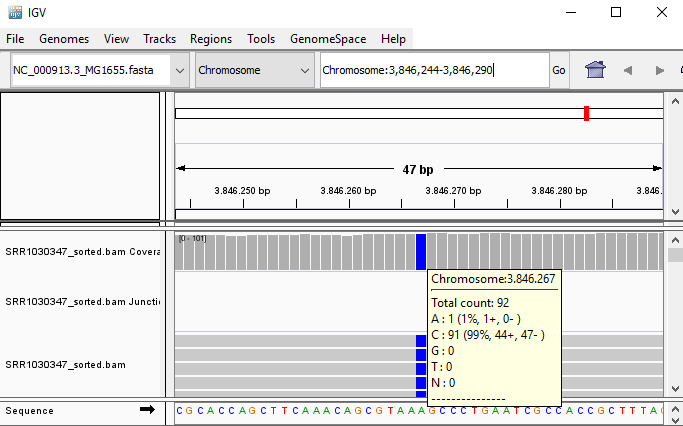
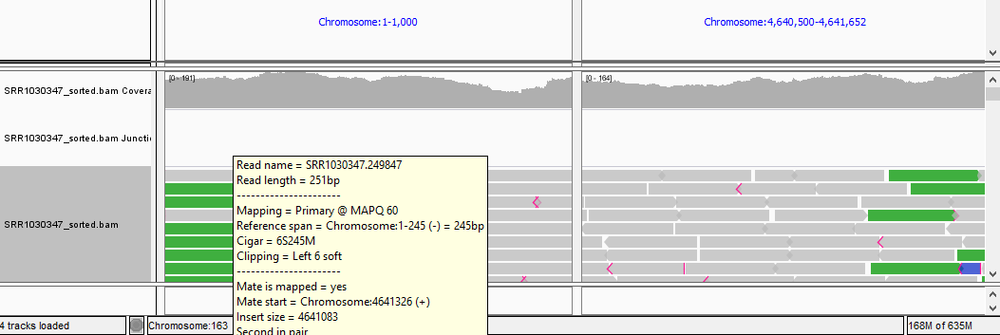
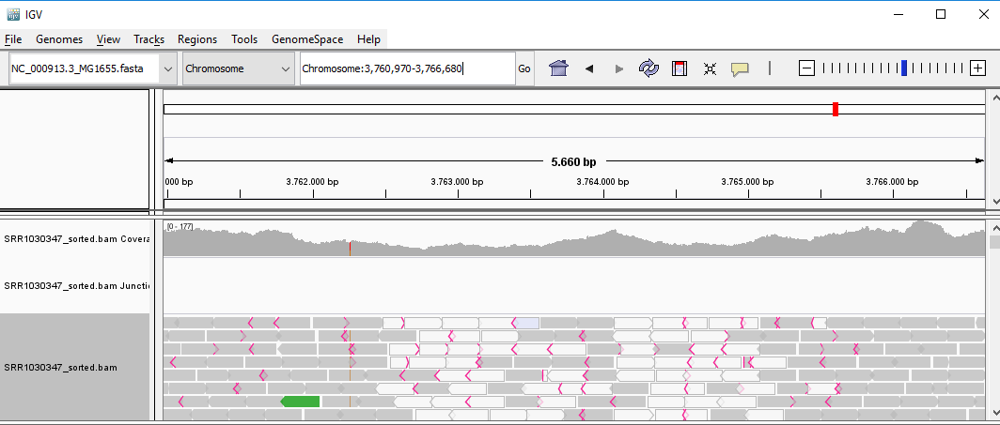

## <a id="L11.1">11.1 - Use Qualimap to assess quality of alignments</a>

After generating alignments and obtaining a SAM/BAM file, how do I know this step went well? The same way as FastQC generates reports of fastq files to assess the quality of raw data, there are programs that generate global reports on the quality of alignments. One popular tool for this is [qualimap](http://qualimap.bioinfo.cipf.es/).
 

**TASK** In the terminal window, in the resequencing folder, type `qualimap bamqc -bam SRR1030347.alignment.sorted.bam`. Open the report file generated by qualimap (there is a report HTML inside a new folder that qualimap creates).

**QUESTION**: What information is in a Qualimap report?

Click Here to see the answer

A Qualimap report includes, among other things:

<ul>
  <li> Number of aligned/mapped reads and other global statistics</li>
  
  <li> Coverage across the genome and the histogram of coverages</li>
  
  <li> Number of duplicated sequences (that align exactly to the same place)</li>
  
  <li> Histogram of mapping quality (how well the reads align, in a Phred scale)</li>
  
  <li> Distribution of insert size (length of fragments, only available with paired-end alignments)</li>
 
</ul>

 

**QUESTION**: Is the whole genome covered in the example you ran? 

Click Here to see the answer

	No, only a small subset of locations in the genome have reads aligned. This dataset only contains reads for a set of predefined regions.

 

Many of the plots produced by Qualimap are similar to the ones produced by FastQC. There are nonetheless, figures that are specific to alignments. One important figure to look at is the **alignment rate** (percentage of the total reads that align). In this case, we want it to be as close as possible to 100%. In the case of bacterial sequencing or targeted (eg. exonic) sequencing you expect >95% successful alignment, but if sequencing a full mammallian genome (with many duplicated areas) it may be normal to have as low as 70-80% alignment success. Another alignment-specific figure is the **coverage** along the genome. The coverage on a position is the number of reads whose alignment overlap with that position. Another factor to take into account is the amount of duplicated sequences. Usually, duplication levels higher than 20% are not a good sign (they're a sign of low input DNA and PCR artifacts) but again, depends on what you are sequencing and how much. In any of these factors one has to anticipate the expected “quality” for your application.
 
 

**TASK**: Open the reports example_HiSeqBGI.pdf and example_MiSeq.pdf (click on the pdf files, or use acroread). Both reports are from alignments to Escherichia coli.

**QUESTION**: What is the difference in the sequence coverage between those two files? 

Click Here to see the answer

	The HiSeq_BGI example displays a homogeneous coverage of ~110x, with a few noticeable drops (the largest one, at least probably due to a deletion, and a small region in the end that displays a coverage of ~170x (probably due to a duplication event). The MiSeq example displays a more heterogeneous coverage between 25-40x coverage, with a noticeable dip towards the end (likely to be due to a deletion).

 

**QUESTION**: What is the difference in the insert size histograms between those two files? 

Click Here to see the answer

	The HiSeq_BGI example displays a homogeneous insert size between 450-500bp. The MiSeq example displays a broad distribution of fragment lengths between 50-800bp. HiSeq_BGI is the result of a technique that fragments DNA mechanically and fragments of a given length are size-selected in a gel. On the other hand, the MiSeq example uses the Nextera library preparation kit, where the DNA is fragmented using an enzyme that immediately adds the sequencing primers.

 

**QUESTION**: Given what you saw in the two previous questions, can you think of reasons that may explain the more heterogeneous coverage of the MiSeq example (particularly the heterogeneity observed along the genome)?

Click Here to see the answer

	The lower coverage may explain a higher local variation, but not the genome-wide positional bias in coverage. Another explanation is the use of enzymatic fragmentation, which is not entirely random, but again this is unlikely to explain the positional variation. A more likely explanation is that bacteria are still in exponential growth in the case of the MiSeq example, which would explain a greater amount of DNA fragments obtained from the region surrounding the origin of replication.

 
 

## <a id="L11.2">11.2 - Use IGV to visualize the content of a BAM file</a>

You can also directly visualize the alignments using appropriate software such as [IGV](https://www.broadinstitute.org/igv/) or [Tablet](https://ics.hutton.ac.uk/tablet/).
 

**TASK** In the terminal window, type `igv*` Wait some time, and the IGV browser should appear. First, load the reference genome used for the alignment (load genome NC_000913.3_MG1655.fasta as file). You should see a chromosome of ~4.5Mb appearing, which is the genome size of Escherichia coli. Next, load the file SRR1030347.alignment.sorted.bam and/or the one you downloaded from Galaxy. You should see new tracks appearing in IGV when you load a file. 

**QUESTION:** Paste in the interval window on the top this position: 'Chromosome:3846244-3846290'. What can you see? 

Click Here to see the answer

You can see an A to C SNP (Single Nucleotide Polymorphism) at position 3846267.

 

**QUESTION:** Paste in the interval window on the top these two positions separated by space: 'Chromosome:1-1000 Chromosome:4640500-4641652'. What can you see? 

Click Here to see the answer

You should see colors in some reads. These colors mean that the fragment lengths (estimated by the distances between the paired reads) are much significantly different to the mean fragment lengths. These are usually an indication of a structural variant (such as a large deletion). In this case, the estimated fragment length is the size of the genome! This is easy to understand if you realize this is a circular genome from a bacteria, and thus it is natural that a read aligning in the "beginning" of the genome may have its pair aligning in the "end" of the genome.
	
 
	

 

**QUESTION:** Paste in the interval window on the top this position: 'Chromosome:3759212-3768438'. What can you see? 

Click Here to see the answer

You can see two regions where the reads are marked in white, both with slightly less coverage than the remaining regions marked in gray. The reads marked in white have a mapping quality of Q=0, which means the aligner does not know where these reads actually belong to. Most genomes (particularly mammallian genomes) contain areas of low complexity, composed mostly of repetitive sequences. In the case of short reads, sometimes these align to multiple regions in the genome equally well, making it impossible to know where the fragment came from. Longer reads are needed to overcome these difficulties, or in the absence of these, paired-end data can also be used. Some aligners (such as bwa) can use information on paired reads to help disambiguate some alignments. Information on paired reads is also added to the SAM file when proper aligners are used.

 

 

**NOTE**: Assess how well you achieve the learning outcome. For this, see how well you responded to the different questions during the activities and also make the following questions to yourself.

* Did you broadly understand the different aspects to consider when evaluating the quality of your alignments?

* Could you use Qualimap to produce quality reports from your SAM/BAM alignments? 

* Did you broadly understand the information in a Qualimap report and use it to detect potential issues in your data? 

* Could you use IGV to visualize alignments in the SAM/BAM format? 

 

### Back

Back to [first page](https://maccardoso.github.io/ELB18S/).
