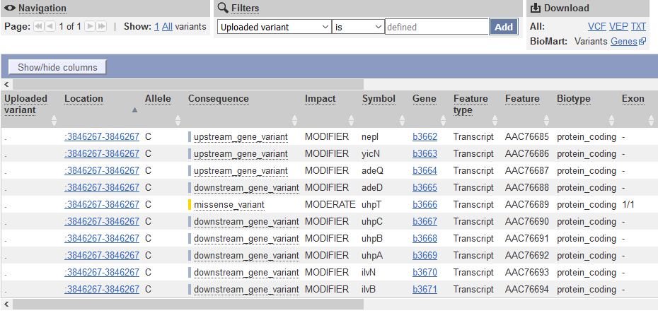

## <a id="L12.1">12.1 - Variant detection in resequencing experiments</a>

After aligning reads against a reference genome, you can now see where and how the individual(s) genetic sequence differs from the reference genome. Using IGV, you have detected one mutation (a Single Nucleotide Polymorphism - SNP). To do this in a systematic way, there are specialized tools such as [GATK](https://www.broadinstitute.org/gatk/) and [freebayes](https://github.com/ekg/freebayes) that perform genotype attribution and detection of genetic variants from SAM/BAM alignment files.
 
 

**TASK** In the commandline, in the resequencing folder, type `freebayes -f NC_000913.3_MG1655.fasta SRR1030347.alignment.sorted.bam > SRR1030347.alignment.vcf`. Open the resulting vcf file using a text editor or a spreadsheet.

The current standard for reporting genetic variants is the variat call format ([VCF](https://samtools.github.io/hts-specs/VCFv4.2.pdf)), which is a tabular text-based format, where each line contains information about one putative variant detected by the software.

**QUESTION:** Are there variants in the vcf file you generated? What is the mutation with the highest confidence in the file? Note: quality is in the 4th column of the vcf file, in the Phred scale.

Click Here to see the answer

	Yes, there are several variants found, most of them with very low quality. There is only one variant with high quality (Q=2754.76), at position 3846267 (A>C). Do you recognize this mutation from before?

 

Sequencing and alignment errors cause many artefactual variants to appear. There are several filtering steps that need to be performed to minimize such errors.

 

**TASK** In the terminal, type `freebayes -0 -f NC_000913.3_MG1655.fasta SRR1030347.alignment.sorted.bam > SRR1030347.alignment.high_quality.vcf`. Open the resulting vcf file using a text editor or a spreadsheet.

**QUESTION:** How many variants do you find now?

Click Here to see the answer

	Only the high quality variant is found now. The -0 parameter in freebayes applies common quality filters to select more confident variants.

 

After inferring trustworthy variants, their functional annotation (namely, of their impact) is usually performed by specialized tools such as the Variant Effect Predictor ([VEP](http://www.ensembl.org/info/docs/tools/vep/index.html)) that take into account information on the reference genome (namely, where are the genes).

 

**TASK** Go to the website [bacteria.ensembl.org](http://bacteria.ensembl.org). Select `Tools` and`Variant Effect Predicto`. Upload the vcf file (the last one you generated) and press "Run".

 

 

**QUESTION:** What is the effect predicted by VEP of the A to C mutation we observed?

Click Here to see the answer

The SNP causes a missesse mutation of the gene uhpT, causing an amino acid change from Phenylalanine to Valin at position 301 of the protein.

 

 

Single nucleotide polymorphisms (SNP) are the variants that are most easily and commonly reported. Other variants pose different challenges and some are particularly difficult, such as the detection of transposable element activity. [Breseq](http://barricklab.org/twiki/bin/view/Lab/ToolsBacterialGenomeResequencing) is a software specialized in detecting several types of genomic events in short timescale evolutionary experiments in bacteria, including the movement of transposable elements. It produces user-friendly variant reports, including the functional annotation of variants that have been detected. This means it can predict not only which variants there are and where they are, but also their potential effects (in which genes, if they fall in a coding region, etc...).

 

**TASK**: Unzip the content of the file breseq_results.zip. Inside the folder, open the file index.html (using a web browser such as Firefox). Identify the mutation in the uhpT gene that we saw before. Click on the read alignment (RA) evidence link to see the evidence that supports it.

**QUESTION:** What other mutations are found? What type of evidence is used for each of them?

Click Here to see the answer

There are 6 SNPs, 2 single base insertions, 1 small duplication and 2 large deletions. For SNPs and single base insertions only read alignment evidence is required. For deletions, missing coverage is necessary, as well as evidence for the new junctions that appear due to the deletion. For duplications, there is the evidence of the new junctions.

In the bottom of the page, we can see unassigned missing coverage and junction evidences. They are indications of possible variants, but for which not all criteria are met (eg. there is missing coverage, but no junctions to unequivocally identify a deletion).

 

**NOTE**: Assess how well you achieve the learning outcome. For this, see how well you responded to the different questions during the activities and also make the following questions to yourself.

* Did you broadly understand the process of finding variants from alignments?

* Could you use freebayes to infer variants?

* Did you broadly understand the content of a VCF file?

* Did you broadly understand the process of inferring the effect of a variant?

* Could you use the VEP online tool to infer the effect of variations in a VCF file?

* Did you broadly understand the output of breseq and the challenge of finding different types of vriants?

 
 

## <a id="L12.2">12.2 - Denovo genome assembly and annotation</a>

Another very common application of NGS, particularly for bacteria and virus without an assembled genome, is to obtain its complete genome from the assembly of millions of short reads. This poses significant computational challenges and novel methods had to be devised to deal with the complexity. The most popular tools use [de-bruijn graphs](https://en.wikipedia.org/wiki/De_Bruijn_graph) to assemble millions of short reads. Although it is becoming much more feasible, an assembly is still a very computer intensive process that needs to be run in powerful servers for most cases (particularly in longer and repeat-rich eukaryote genomes). [Spades](http://cab.spbu.ru/software/spades/) (mostly for bacteria) and [sga](https://github.com/jts/sga/wiki) (for longer eukaryote genomes) are examples of popular assemblers.

 

**TASK**: In the terminal, move to the resequencing folder and type `spades.py -1 SRR1030347_1.fastq.interval.fq -2 SRR1030347_2.fastq.interval.fq  -o SRR1030347_spades`. After spades finishing successfully, there should be a folder SRR1030347_spades. Inside the folder you should have a scaffolds.fasta file.

**QUESTION**: What's in scaffolds.fasta file? 

Click Here to see the answer

As the name implies, this file contains the scaffolds that spades was able to assemble. Each scaffold is in a separate fasta entry, and represent the longest stretch of nucleotides that spades could connect together. 

Spades conveniently adds in the scaffold name (the fast entry) some extra information, such as its length and the mean coverage of the scaffold. This is very useful to know, since very short scaffolds or with very little coverage are likely to be artifacts and can be later removed. 

You may also have noticed the presence of a contigs.fasta file. Contigs are the longest stretches of nucleotides (without gaps) that the assembler can connect together. Using paired-end information, the assembler may connect contigs together into longer scaffolds (adding gaps between contigs). In the case of single-end reads, the scaffolds file will be the same as the contigs file.

 

**QUESTION**: You sequenced DNA from one bacterial species using only single-end and short (100bp) sequencing data, but when doing a denovo assembly of the genome, instead of obtaining a single sequence for the full circular genome, you obtained several smaller sequences. What should be the main reason for this result? Will getting more sequences of the same type necessarily solve the problem? 

Click Here to see the answer

The major limiting factor in the assembly process is the presence of repetitive sequences that are longer than the fragment length we can sequence. 

In this case, any sequence that is longer than 100bp and appears more than once in the genome will make it impossible for the assembler to unambiguously connect its borders, thus breaking the assembly into smaller contigs. Getting more small sequences will not solve the underlying limitation, only getting longer reads, or/and using paired-end data.

 

When doing de novo genome assembly, we need to scaffold millions of pieces together. This process depends non-linearly on many factors. 

 

**QUESTION:** What factors may influence the genome assembly process?

Click Here to see the answer

<pre><ul>
  <li> <strong>Quality of Reads</strong>: sequences with more errors are likely to make the assembly process harder and error-prone.</li>
  
  <li> <strong>Length of Reads</strong>: as we discussed before, the longer the reads, the more likely it is to have unambiguously overlapping fragments. If we can only have short reads (such as in illumina), we can simulate longer reads through paired-end sequencing. Nonetheless, even this is limited to 1-2kb. Methods such as mate-pair sequencing allow to simulate even longer fragments (5k, 20k or longer) by using paired-end reading with circularized fragments. Modern sequencing technologies such as PacBio or MinION allow the direct sequencing of very long reads (up to 100kb or more), although with a much higher error rate.</li>
  
  <li> <strong>Number of Reads</strong>: The more we have usually the better, although there is always the limitation of the length we discussed before. Nonetheless, having too many reads may also cause trouble in the assembly. It is usually not recommended to have more than 200x global coverage, as spurious errors may appear frequently enough to make the assembler generate false contigs.</li>

</ul></pre>

 

We usually want the assembled genome to be in as few pieces as possible, and that each piece is as large as possible. Of course, we also want the sequences to be as correct as possible. There are different measures we need to take into consideration to evaluate the quality of an assembly. [Quast](http://bioinf.spbau.ru/quast) is an example of a software that produces several measures to assess the quality of genome assemblies. Quast can test one (or several) genome assemblies (as fasta files).

 

**TASK**: We have generated genome assemblies using different datasets to test different factors that affect the assembly process. Namely, we compared datasets with raw unprocessed reads (less_clean) and quality trimmed reads (more_clean). We have also compared datasets using single or paired reads. Another experiment compared single-end datasets of different read length (shorter_50bp, medium_100bp, longer_200bp). Finally, we compared the effect of using more reads (cov_200k, cov_1M, cov_2M). To compare all these assemblies (all derived from the same Escherichia coli sample), we used Quast to obtain different quality measures. In the assembly experiments folder, unzip the file quast_results.zip. Open the file report.html inside the folder quast_results.

**QUESTION:** What quality measures are produced by Quast?

Click Here to see the answer

Among several measures, a Quast report contains:

<pre><ul>
  <li> Number of contigs and their length. Ideally, we want to have one contig per chromosome (in this case, we would like to have only 1 contig), so we want as few and as long as possible, with the largest total length (sum of the length of all the contigs). A number that is most often used to measure the quality of an assembly is the N50, which is the length of the smallest contig such that at least 50% of the total length of the assembly is covered by contigs larger than that contig.</li>
  
  <li> Statistics depending on a given reference genome. We may have a very long assembly, but it may still be wrong. To try to assess this, if we know that our sample should be relatively similar to a given known species (in our case Escherichia coli) then we can use that information to assess for quality. We can see how close if the total length of the assembly is to the length of the reference (Genome Fraction), how many bases are different from the assembly (mismatches) and how many structural variants we find (misassemblies). The argument is, if we are comparing different assemblies for the same sample, we want to minimize mismatches and misassemblies. Nonetheless, if we are doing an assembly, that's because we suspect the sample we are working with is sufficiently different from the reference. Therefore, these reference-based measures need to be taken with care.</li>

</ul></pre>

 

**QUESTION:** What is the best assembly? Why?

Click Here to see the answer

The best overall assembly seems to be the paired assembly. It has fewer contigs and longest N50, covering most of the reference genome while keeping a low number of mismatches. The results indicate that cleaner reads, paired-end data, longer reads and more coverage usually give better assemblies. Nonetheless, there are always balances that need to be taken into consideration. For example, more_clean was obtained from less_clean by filtering, and thus contains fewer data. That's probably why, although we obtain a longer N50 and fewer mismatches, we lose some fraction of the genome coverage.

 

The genome assembly process generates a sequence of nucleotides in the form of a fasta file. Now we need to annotate the genome, namely to know where genes are and what are their possible functions. In bacteria, this is reasonably feasible, and there are already programs that allow a reasonably good quality annotation, such as [prokka](https://github.com/tseemann/prokka). In eukaryotes, this process is much harder and requires multiple steps of validation. These programs identify the positions in the genome where genes are, as well as their sequence (RNA and protein). 

 

**TASK**: In a resequencing experiment, a set of reads did not align to the reference. These reads were assembled using spades, and the resulting assembly was annotated using prokka. Open and browse the assembly with IGV by loading the reference genome 'example_assembly.fasta'. Then, open the prokka annotation file 'example_assembly.prokka.gff' (containing the positions of the genes). You can also open in a text editor the files example_assembly.prokka.fasta (protein sequences) and example_assembly.prokka.gbk (Genbank file with the annotations).

**QUESTION:** How many genes were detected by prokka? What can be the origin of these sequences?

Click Here to see the answer

16 genes were detected. Most of them are hypothetical, but several seem to be related to antibiotic resistance. They could have originated from horizontal transfer from other organisms. Nonetheless, if you blast the original assembly sequences, you would find that this is a plasmid artificially inserted in the bacteria by the researcher.

 

**NOTE:** Annotating a genome allow us to use other measures to infer the quality of our assembly. Namely, we usually prefer assemblies where we can annotate more genes (assemblies that are too fragmented, or with incorrect sequence, have less annotated genes). One particular test relates to genes that are present in all species, where we prefer assemblies where we can detect as many of these genes as possible.

 

**NOTE**: Assess how well you achieve the learning outcome. For this, see how well you responded to the different questions during the activities and also make the following questions to yourself.

* Did you broadly understand the process of genome assembly?

* Could you use spades to assemble contigs from short reads?

* Did you broadly understand different factors affecting the genome assembly process?

* Can you list different measures to assess the quality of a genome?

* Did you broadly understand the output of Quast to compare different assemblies?

* Did you broadly understand the process of genome annotation?

 
 

## <a id="L12.3">12.3 - Transcriptomics using RNA-Seq</a>

Another very common application of NGS is to sample the transcriptome, much like gene expression microarrays. The main advantages of RNA Sequencing versus microarrays is a better signal-to-noise ratio and the ability to detect novel transcripts (something impossible with microarrays). Data processing is similar to genomic resequencing, although mRNA is usually spliced (in eukaryotes at least), and thus we need to use splice-aware aligners such as [Tophat](https://ccb.jhu.edu/software/tophat/index.shtml) and its successor [Hisat](http://ccb.jhu.edu/software/hisat2/index.shtml) to map short transcriptomic reads to a reference genome. These aligners are based on the burrows-wheeler aligners we discussed previously, but with extensions to deal with the possibility of spliced reads. Hisat was specifically designed to handle RNA-Seq data.

For this practical session, we will use data extracted from [Guilgur et al, 2014](https://elifesciences.org/content/3/e02181). In this Drosophila melanogaster dataset, we have two conditions, one control wild-type (WT) and a mutant in the fandango gene (mut), with two replicates for each. To make it quick to run, we have extracted data for a very limited set of genes.

**NOTE**: Nowadays, it is more common to use 3 or more replicates for each condition.

 

**TASK**: Upload all the files in the transcriptomics folder into Galaxy. Align the reads in the fastq files against the inbuilt Drosophila genome using Hisat2 in Galaxy (note: the fastq data is already of good quality). Use the inbuilt genome to avoid the indexing step. Optionally, you can also align using the genome you downloaded to see the difference in the time it takes. Finally, download all the BAM files you obtained in Galaxy, as well as their companion index bai files.

 

**TASK**: In IGV, load as genome the Drosophila melanogaster fasta in the transcriptomics folder. Next, load the BAM files for all the RNA samples. Finally, load the provided sample gtf file (not as genome).

**QUESTION:** Paste in the interval window on the top this position: 3L:15041314-15044195'. What can you see? 

Click Here to see the answer

The gene Rpnr12r (Fbgn0036465) is expressed in the mutant samples, but not in the wild-type samples.
	

	

 

**QUESTION:** Paste in the interval window on the top this position: X:20693985-20697646'. What can you see? 

Click Here to see the answer

The gene Run (FBgn0003300) is slightly more expressed in the mutant samples. But the most noticeable difference is that the gene is poorly spliced in the mutant samples. This mutant affects a component of the spliceosome, and thus some of the genes are not spliced correctly, like this gene.
	

	

 

**QUESTION:** Paste in the interval window on the top this position: X:5900729-5904706'. What can you see? 

Click Here to see the answer

Gene Act5c is very highly expressed in all samples.
	

	

 

**QUESTION:** In the gene Act5c samples, the IGV plot seems more similar with regards to replicate than the genotype. What can be causing this? 

Click Here to see the answer

The gene Act5c is a ubiquitously expressed gene, so it is not differentially expressed between the two groups. Nonetheless, we can see that the distribution of reads is not entirely random, which is particularly noticeable in the samples for the second replicates, where reads tend to fall close to the end of the transcript. This RNA was purified using a process captures the poly-A tails.

An accumulation of RNA towards the end of the transcripts is probably due to a higher degradation of the RNA material when processing the samples for the second replicates (which were processed at a different time than the first replicates). This type of differences between replicates are also known as batch effects.

 

**QUESTION:** Would you be able to detect all of what you saw here using microarrays?

Click Here to see the answer

With microarrays, you would be able to detect that the gene Rpn12R is differentially expressed, or that the gene Act5c is highly expressed. Nonetheless, you would not be able to look for variants, and you would not be able to see that the gene Run has splicing problems. You also cannot look for genes (or alternative transcripts) that were not pre-specified in the array you used. Moreover, you would not be able to identify potential batch issues like what we noticed in the last example of gene Act5c.

 

We could see in IGC that gene Rpn12R is differentially expressed between the two groups. But like in the case of variant detection, we need to use specialized software to systematically detect differentially expressed genes. To perform differential expression analysis, one needs to count how many times a different transcript/gene is read. Popular tools to generate these counts from a SAM/BAM file include [htseq-count](http://htseq.readthedocs.io/) and [featurecounts](http://bioinf.wehi.edu.au/featureCounts/).

 

**TASK**: In Galaxy, use the tool htseq-counts to generate tables of counts for each sample. Use the generated BAM files and the provided sample gtf file as inputs. Put stranded as 'No', and leave the rest as the default. Then press execute.

**QUESTION:** How many counts has the gene Rpn12R (FBgn0036465) in the differente samples?

Click Here to see the answer

The gene FBgn0036465 has 0 counts in WT_lib1, 1 in WT_lib2, 219 in mut_lib1 and 263 in mut_lib2.

 

**QUESTION:** You probably noticed the existence of a "no feature" table. What do you think is reported there?

Click Here to see the answer

The "no feature" table reports reads that were not assigned to genes, whether because they did not align, or they align in repetitive areas (not unique), because they do not overlap a gene, or the software could not decide to which gene it belongs to (ambiguous).  

 

From these count files, several methods can be then used to perform statistical tests. Given that sequencing data is based on discrete counts, most of the popular methods are based on the derivations of the binomial distribution. Similarly to microarrays, there are many available tools to perform these analyses using the [R language](https://www.r-project.org/about.html) (such as [edger](https://bioconductor.org/packages/release/bioc/html/edgeR.html) and [DESeq](http://bioconductor.org/packages/release/bioc/html/DESeq.html)).

 

**TASK**: Use DESeq2 in Galaxy to calculate differential gene expression from the counts you generated. As factor use "Genotype", as factor level 1 use "mut", and as count files the 2 mut count tables generated before (the ones with the gene counts, not the "no feature" tables). As factor level 2 use WT and as count files the 2 WT count tables. Leave the rest as default and execute. 

**QUESTION:** How many genes were detected to be differentially expressed (padj<0.05)?

Click Here to see the answer

Only the gene FBgn0036465 (Rpn12R). The gene FBgn0003300 (run), despite having a bit more expression in the mutant, is not considered to be significantly differentially expressed.

 

**QUESTION:** What information is in the DESeq2 result table?

Click Here to see the answer

<pre><ul>
   <li> <strong>GeneID</strong> (The identifier of the gene - in this case the Flybase identifier)</li>
	
   <li> <strong>Base Mean</strong> (The mean normalized counts of all the samples - a measure of how much is a gene expressed)</li>
	
   <li> <strong>log2(FC)</strong> - log2 of the Fold Change (when positive, more expressed in one group than the other, and the reverse when negative)</li>
	
   <li> <strong>StdErr</strong> - a measure of the confidence in the true value of the estimated log2(FC)</li>
	
   <li> <strong>Wald-Stats</strong> - A value measuring how far is the observed log2(FC) from the 0 taking the StdErr into account</li>
	
   <li> <strong>P-value</strong> - A value measuring how likely it is to obtain the observed log2(FC) by chance</li>
	
   <li> <strong>P-adj</strong> - The P-value corrected for multiple testing (the value that should be used in the end)</li>
	
</ul></pre>

 

**QUESTION:** What information is in the DESeq2 plots?

Click Here to see the answer

<pre><ul>
   <li> <strong>PcA plot</strong>: Displays the samples through a projection that most explain the variation between samples</li>
	
   <li> <strong>Sample-to-Sample Distances</strong>: Like the previous plot, it displays how similar are the samples between each other</li>
	
   <li> <strong>Dispersion estimates</strong> - A plot displaying the approximations DESeq2 does to estimate the true log2(FC)</li>
	
   <li> <strong>Histogram of P-values</strong> - As the name implies, it depicts the distribution of P-values for all genes</li>
	
   <li> <strong>MA-plot</strong> - plots the M (fold change) against the A (total expression) for all genes</li>
</ul>	
   In this case, since there were only 8 genes, the plots displaying gene information were basically empty.
</pre>	

 

**NOTE**: Assess how well you achieve the learning outcome. For this, see how well you responded to the different questions during the activities and also make the following questions to yourself.

* Could you use Hisat to align RNA-Seq reads against a reference genome?

* Could you use htseq-counts to generate gene counts from alignments and a reference annotation?

* Could you use DESeq2 to obtain differentially expressed genes?

* Did you broadly understand the process of differential gene expression analysis?

 
 

## <a id="L12.4">12.4 - 16S Metagenomics</a>

In MetaGenomics, we don't sequence a single individual or clone, but a community of individuals of different species, usually with the goal of identifying the species that are present, and what are their relative abundances. As you can imagine, sequencing many genomes simultaneously (each of them present at different frequencies) is a very complex task, and techniques to do it efficiently are still an area of active research. Sequencing the DNA of all genomes simultaneously is also known as "Whole Shotgun Metagenomics".

Another simpler approach to do this is to sequence a single common locus with sufficient variability to allow distinguishing as many species as possible. 16S is a locus commonly used to sample bacterial communities. In this case, we don't need to assemble the reads, but to compare them against a reference database of 16S genes of known species. This is what software such as [Qiime](http://qiime.org/) and [mothur](https://www.mothur.org/) do. 

Since there are potentially many species not yet sequenced (particularly since most bacteria are unculturable), one may lose a lot of information if only trying to match a reference database. These programs also give the possibility of clustering some (or all) of the input sequences into Operational Taxonomical Units (OTU), which roughly translate into different species (usually an OTU is defined as a cluster of sequences with more than 97% similarity), thereby avoiding the possible gaps in the reference databases.

 

**TASK**: Unzip the file QIIME_core_diversity_report.zip. This contains the result of applying qiime into a dataset derived from [Batista et al. (2015)](https://www.nature.com/articles/ncomms9945). This data contains high-throughput 16S rRNA gene sequencing data of DNA extracted from faecal samples from two time points of a bacterial evolution experiment (day 0 and day 3) of wild-type mice where the mice from day 3 of the experiment were treated with Streptomycin and subsequently colonized with Escherichia coli. Open the html file inside the folder you just extracted. 

**QUESTION:** Click on the link for the bar charts in the Taxonomic summary results (by Antibiotic Usage). What is the major difference between the untreated samples and the ones subjected to streptomycin?

Click Here to see the answer

The antibiotic removed most of the firmicute species, which were replaced by the Escherichia coli that was artificially inserted.

 

**QUESTION:** Click on the link for the rarefaction plots in the Alpha Diversity Results. Select different Metrics for the Category AntibioticUsage. What is the difference between the untreated samples and the ones subjected to streptomycin?

Click Here to see the answer

The antibiotic-treated samples have much lower diversity (less bacterial taxa) than the untreated samples.

 

**QUESTION:** Click on the link for the rarefaction plots in the Alpha Diversity Results. Select different Metrics for the Category AntibioticUsage. What is the difference between the untreated samples and the ones subjected to streptomycin?

Click Here to see the answer

The antibiotic-treated samples have much lower diversity (less bacterial taxa) than the untreated samples.

 

**QUESTION**: Click on the link for the PCoA plot (unweighted Unifrac) in the Beta Diversity results. Do you see clusters of samples forming? 

Click Here to see the answer

The antibiotic-treated samples separate well from the untreated samples.

 

**QUESTION**: Click on the link for the Category Significance (AntibioticUsage). Which groups of OTUs are differentially present in untreated versus streptomycin treated (FDR<0.05)? Does it agree with what you saw before? 

Click Here to see the answer

Group significance tests which OTUs are significantly present in a group versus another (much like RNA-Seq differential gene expression). Many firmicute taxa are differentially present between the two groups, as well as Escherichia. This agrees with what we say before in the bar plots.

 
 

**NOTE**: Turn on the green light when you're finished. Assess how well you achieve the learning outcome. For this, see how well you responded to the different questions during the activities and also make the following questions to yourself.

* Did you broadly understand the process of 16S metagenomics data analysis?

* Did you broadly understand the concept of alpha diversity (total diversity)?

* Did you broadly understand the concept of beta diversity (comparative diversity)?
 
 
 

## <a id="L12.5">12.5 -Epigenomics</a>

NGS can also be used to sequence specific regions of interest in the genome. An example of this are regions bound by transcription factors (TF). Using antibodies specific for a given TF, the bound DNA can be selectively extracted and sequenced. In this case, we are interested in knowing which areas of the genome are enriched in sequenced reads (loci bound by the TF). This technique is called ChIP-Seq (chromatin IP followed by sequencing).

We will look at some data from [(Myers et al., 2013)](http://journals.plos.org/plosgenetics/article?id=10.1371/journal.pgen.1003565). In this study, the authors generated a ChIP-Seq against the FNR transcription factor ('FNR_IP'), as well as a control pulldown without the antibody ('INPUT'). Certain programs, such as [MACS](https://github.com/taoliu/MACS), will compare the alignments of the TF ChIP-Seq against the alignments of the genomic control, and determine regions in the genome that are significantly enriched in the ChIP-Seq. To determine which genes were under direct control of FNR, the authors also generated RNA-Seq of a bacterial strain mutated in FNR (FNR-), and compared its gene expression against the wild-type.
 

**QUESTION**: Why do you need the control pulldown to analyse a ChIP-Seq experiment? 

Click Here to see the answer

Due to several factors, some parts of the genome are more frequently extracted than others. Therefore, if we want to know which parts of the genome are being enriched in a ChIP-Seq, we need to control for those intrinsic biases that are not related to the factor we are studying.

 
 

**TASK**: Open IGV, load as genome the file 'ecoli_NC_000913.2_MG1655.fa' in the epigenomics folder. Next, load the annotation file 'NC_000913.2_MG1655.gff', all the '*.bw' files (bigwig files are summary views of the alignments, representing average coverage along fixed-length intervals) and the 'MG1655_FNR_A_VS_INPUT_A_peaks.bed' file (this bed file contains the regions in the genome enriched in the FNR ChIP-Seq). The bigwig files contain summary views of the FNR ChIP-Seq, the genomic control, and the RNA-Seq datasets.

**QUESTION**: Look at the position for the gene dmsA (gi|49175990|ref|NC_000913.2|:938,182-944,626). What is the likely effect of FNR in that gene?

Click Here to see the answer

You can see that the gene dmsA seems to be less expressed in the FNR mutant than in the wild type. Moreover, the FNR ChIP-Seq seems enriched in the region just upstream of the dmsA gene. Therefore, it is likely that FNR is directly and positively regulating the expression of dmsA.

 

 

**QUESTION**: Look at the position for the gene ndH (gi|49175990|ref|NC_000913.2|:1,163,308-1,168,612). What is the likely effect of FNR in that gene?

Click Here to see the answer

You can see that the gene ndH seems to be more expressed in the FNR mutant than in the wild type. Moreover, the FNR ChIP-Seq seems enriched in the region just upstream of the ndH gene. Therefore, it is likely that FNR is direcly and negatively regulating the expression of ndH.

 

 
 

Most often the term epigenetics is associated to DNA methylation. One popular technique to assess methylation is reduced representation bisulfite sequencing (RRBS), where GC-rich DNA is obtained and subjected to bisulfite treatment that converts unmethylated cytosines to uracil. After aligning the reads sequenced after bisulfite treatment with the reference genome, we can have an estimate of the percentage of methylation in those bases, by counting how many of the bases were converted.
 
 

**TASK**: Look at an example of RRBS 'ENCODE_example_BSSeq.bed' (open with a text editor, or use cat in the terminal, or in an excel spreadsheet). The last two columns tell you the total coverage and percentage of methylated bases, respectively.

**QUESTION**: What's the coverage and percentage of methylated bases at position chr1:1000170-1000171?

Click Here to see the answer

The coverage is 82, percentage of methylation (unconverted bases) is 20%.

 
 

**NOTE**: Assess how well you achieve the learning outcome. For this, see how well you responded to the different questions during the activities and also make the following questions to yourself.

* Did you broadly understand the process of ChIP-Seq data analysis?

* Did you broadly understand the concept of integrating information from ChIP-Seq with RNA-Seq to infer possible regulatory events?

* Did you broadly understand the process of Reduced Representation Bisulfite Sequencing (RRBS)?
 

### Back

Back to [first page](https://maccardoso.github.io/ELB18S/).
